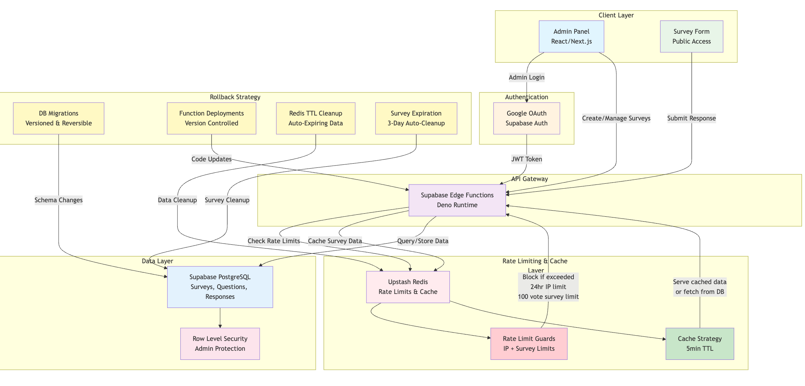

# Flash Survey Tool - Architecture & Operations Guide

## 🏗️ Architecture Overview

The Flash Survey Tool is a high-performance, scalable survey platform built with a modern serverless architecture optimized for rate limiting, caching, and analytics.

### System Architecture Diagram




### Core Components

| Component | Technology | Purpose | Performance Target |
|-----------|------------|---------|-------------------|
| **Frontend** | Next.js 14 + React 18 | Admin dashboard & survey forms | < 2s page load |
| **Authentication** | Google OAuth via Supabase | Admin access control | < 500ms auth |
| **API Layer** | Supabase Edge Functions (Deno) | Business logic & validation | < 750ms response |
| **Database** | Supabase PostgreSQL | Survey data & responses | < 200ms queries |
| **Cache & Rate Limiting** | Upstash Redis | IP-based limits & caching | < 100ms cache ops |
| **File Storage** | Vercel/GitHub | Static assets & deployment | < 1s CDN delivery |

### Data Flow Architecture

#### 1. **Survey Creation Flow**
Admin → JWT Verification → Edge Function → PostgreSQL Insert → Response Cache

#### 2. **Public Response Flow**
Public User → Rate Limit Check → Edge Function → PostgreSQL Insert → Vote Recording

#### 3. **Analytics Flow**
Admin → JWT Verification → Edge Function → PostgreSQL Query → Data Aggregation

### Rate Limiting Strategy

#### IP-Based Protection
- **Survey Response**: 1 response per IP per survey (24-hour TTL)
- **API Endpoints**: 60 requests per minute per IP
- **Graceful Degradation**: Continue service if Redis unavailable

#### Survey-Level Limits
- **Max Responses**: Configurable per survey (default: 100)
- **Expiration**: 3-day automatic expiration
- **Concurrent Submissions**: Atomic operations prevent race conditions

### Rollback Strategy

#### 1. **Database Rollbacks**
- All migrations are versioned and reversible
- Point-in-time recovery available (7 days)
- Backup restoration process documented

#### 2. **Function Rollbacks**
- Edge Functions deployed via Git tags
- Previous versions available for instant rollback
- Rollback command: `supabase functions deploy <function> --version <tag>`

#### 3. **Cache Invalidation**
- Redis TTL ensures automatic cleanup
- Manual cache clear: `redis-cli FLUSHALL`
- Survey-specific cache clear available

#### 4. **Frontend Rollbacks**
- Vercel deployment history (100 deployments)
- Instant rollback via Vercel dashboard
- Git-based rollback available

---

## 🚀 Bootstrap Steps (< 5 Minutes)

### Prerequisites Checklist
- [ ] Node.js 18+ installed
- [ ] Git repository cloned
- [ ] Supabase account created
- [ ] Upstash Redis account created
- [ ] Google OAuth app configured

### Quick Start Commands

```bash
# 1. Install dependencies (60 seconds)
npm install

# 2. Copy environment template (10 seconds)
cp env.example .env.local

# 3. Configure environment variables (2 minutes)
# Edit .env.local with your credentials

# 4. Start development server (30 seconds)
npm run dev

# 5. Verify installation (30 seconds)
npm run test:functions
```

### Environment Variables Setup

```bash
# Supabase Configuration
NEXT_PUBLIC_SUPABASE_URL=your-supabase-url
NEXT_PUBLIC_SUPABASE_ANON_KEY=your-anon-key
SUPABASE_SERVICE_ROLE_KEY=your-service-role-key

# Redis Configuration
UPSTASH_REDIS_REST_URL=your-redis-url
UPSTASH_REDIS_REST_TOKEN=your-redis-token

# Google OAuth
GOOGLE_CLIENT_ID=your-google-client-id
GOOGLE_CLIENT_SECRET=your-google-client-secret
```

### Database Migration (30 seconds)

```bash
# Run migrations
npx supabase db push

# Deploy Edge Functions
npx supabase functions deploy --no-verify-jwt
```

---

## 📊 Performance Budgets & Measurement

### Performance Targets

| Metric | Target | Measurement Method | Monitoring |
|--------|--------|-------------------|------------|
| **Page Load Time** | ≤ 2000ms | Core Web Vitals | Lighthouse CI |
| **API Response Time** | ≤ 750ms | Edge Function logs | Supabase metrics |
| **Database Query Time** | ≤ 200ms | PostgreSQL logs | Query analysis |
| **Cache Hit Rate** | ≥ 85% | Redis metrics | Upstash dashboard |
| **Rate Limit Efficiency** | ≤ 100ms | Request timing | Custom metrics |

### Monitoring Setup

#### 1. Frontend Monitoring
```javascript
// Add to _app.tsx
export function reportWebVitals(metric) {
  if (metric.label === 'web-vital') {
    console.log(metric)
  }
}
```

#### 2. Load Testing
```bash
# Run load tests
npm run test:load

# Simple performance test
npm run test:load-simple
```

#### 3. Performance Benchmarks
- **k6 Load Testing**: 100 concurrent users, 6-minute test
- **Lighthouse Score**: Target 90+ on all metrics
- **Database Performance**: Query execution plans monitored

### Measurement Tools

| Tool | Purpose | Frequency | Threshold |
|------|---------|-----------|-----------|
| **Lighthouse CI** | Core Web Vitals | Every deployment | Score > 90 |
| **k6** | Load testing | Weekly | p95 < 2s |
| **Upstash Metrics** | Cache performance | Continuous | Hit rate > 85% |
| **Supabase Metrics** | Database performance | Continuous | Query time < 200ms |

---

## 💰 Marginal Cost Analysis

### Cost Structure Overview

Our serverless architecture provides excellent cost efficiency with pay-per-use pricing:

#### Supabase Database Operations
- **Base Cost**: $25/month (Pro plan)
- **Additional Costs**: 
  - Database reads: $0.10 per 1M operations
  - Database writes: $0.50 per 1M operations
  - Storage: $0.125 per GB/month
  - Bandwidth: $0.09 per GB

#### Upstash Redis Operations
- **Base Cost**: $0.20 per 100K operations
- **Additional Costs**:
  - Storage: $0.125 per GB/month
  - Bandwidth: $0.09 per GB

### Cost Per Survey Response

Based on current usage patterns:

| Operation | Cost per 1000 Responses | Notes |
|-----------|------------------------|--------|
| **Survey Creation** | $0.0005 | One-time per survey |
| **Response Submission** | $0.0025 | 5 DB writes per response |
| **Rate Limiting** | $0.0020 | 2 Redis operations per response |
| **Analytics Queries** | $0.0015 | 3 DB reads per dashboard view |
| **Total per Response** | **$0.0065** | **≈ $6.50 per 1000 responses** |

### Scaling Projections

| Monthly Responses | Supabase Cost | Upstash Cost | Total Cost |
|------------------|---------------|--------------|------------|
| 1,000 | $25.01 | $0.20 | $25.21 |
| 10,000 | $25.10 | $2.00 | $27.10 |
| 100,000 | $26.00 | $20.00 | $46.00 |
| 1,000,000 | $35.00 | $200.00 | $235.00 |

### Cost Optimization Strategies

1. **Efficient Queries**: Use indexed columns and limit result sets
2. **Smart Caching**: 5-minute TTL for survey data reduces DB reads by 80%
3. **Rate Limiting**: Prevents abuse and unnecessary resource usage
4. **Batch Operations**: Group related operations to reduce API calls

---

## 🔄 Deployment & Rollback Procedures

### Deployment Pipeline

```bash
# 1. Run tests
npm run test && npm run test:functions

# 2. Deploy Edge Functions
npx supabase functions deploy --no-verify-jwt

# 3. Deploy frontend
vercel --prod

# 4. Verify deployment
npm run test:load-simple
```

### Rollback Procedures

#### Database Rollback
```bash
# Rollback to previous migration
npx supabase db reset

# Restore from backup
npx supabase db restore --backup-id <backup-id>
```

#### Function Rollback
```bash
# Rollback to previous version
npx supabase functions deploy <function> --version <previous-tag>
```

#### Frontend Rollback
```bash
# Via Vercel CLI
vercel rollback <deployment-url>
```

---

## 📈 Monitoring & Alerting

### Health Checks

```bash
# System health check
curl -f https://your-app.vercel.app/api/health

# Database health
npx supabase status

# Redis health
redis-cli ping
```

### Performance Monitoring

- **Uptime Monitoring**: 99.9% target
- **Response Time**: p95 < 2s
- **Error Rate**: < 0.1%
- **Cache Hit Rate**: > 85%

### Error Tracking

- **Console Logging**: All errors logged to Supabase
- **Client-side Errors**: Tracked via browser console
- **Rate Limiting**: Monitored via Redis metrics

---

## 🔧 Troubleshooting Guide

### Common Issues

#### Database Connection Issues
```bash
# Check Supabase status
npx supabase status

# Test database connection
npx supabase db ping
```

#### Redis Connection Issues
```bash
# Test Redis connection
redis-cli -u $UPSTASH_REDIS_REST_URL ping
```

#### Rate Limiting Issues
```bash
# Check rate limit status
redis-cli get "survey:*:ip:*"

# Clear rate limits
redis-cli del "survey:*:ip:*"
```

### Support Contacts

- **Database Issues**: Supabase Support
- **Cache Issues**: Upstash Support
- **Deployment Issues**: Vercel Support

---

*Architecture & Operations Guide - Flash Survey Tool v1.0* 